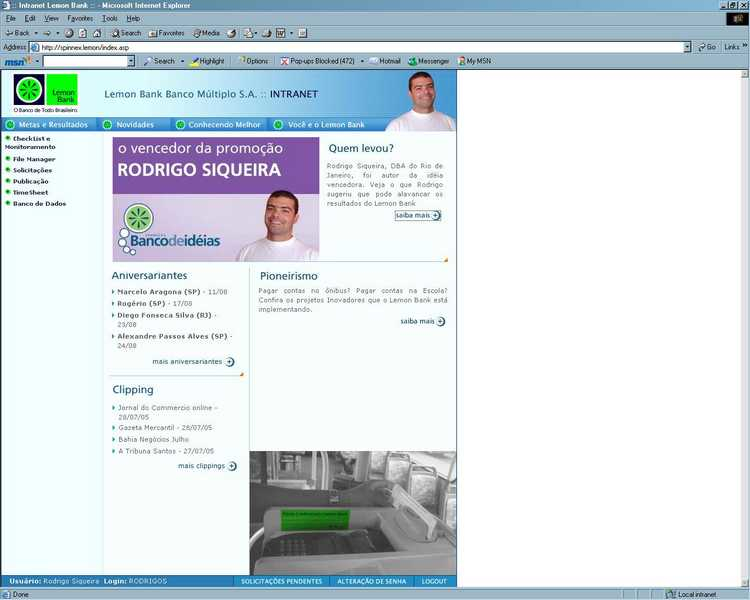

# Visual Detailed CV - Rodrigo Souza

Details of my career as a data professional: Highligts, cool projects, videos and so on. The objective is to register, and to share, here what doen't fit into a "regular CV". At the end of the day, a picture is worth a thousand words. Like the image below, my collection of Conferences Badges. This CV has photos of some of these deliveries, as well as images and links for videos I recorded for Microsoft AI Organization.

The next image is interesting. I created this CV visualization, the first image below, for a "Data Scientist Role" presentation. I also used it into my [How I became a Data Scientist](https://www.linkedin.com/pulse/how-did-i-become-data-scientist-rodrigo-souza/), which had thousands of visualizations. This image was also useful to help me understand how much my career has changed, how I went from reactive to proactive in terms of adopting new technologies. I really like to be an early adopter for new technologies.

Don't you think that this kind of CV is much more efficient than a regular one?

## Key Personal Links

+ [LinkedIn Profile](https://www.linkedin.com/in/rodrigossz/)
+ [LinkedIn Articles](https://www.linkedin.com/in/rodrigossz/detail/recent-activity/posts/)
+ [Blog: Data is the New Oil](https://datanewoil.tumblr.com/)
+ [Youtube Channel](https://www.youtube.com/channel/UCZ_z0MqG2XMyxAE18V6NF1A)
+ [GitHub](https://github.com/Rodrigossz)

## Applied Data Scientist at Microsoft US - Redmond, WA - November 2017 - Today

Initially working with the LearnAI team, I was an AI Developer and Instructor. I created and delived the trainings, that were end-to-end AI Solutions using multiple products like Cognitive Services, Azure Machine Learning, CosmosDB, Bots, among others. All content included theory materials and thands-on labs. I delivered in-person and online trainings, including  "train the trainers" courses and all of the biggests Microsoft conferences like Ready, Inspire, Ignite, and MLADS. I had the opportunity to teach AI in Redmond, Seattle, Bellevue, Bogota, Sao Paulo, London, Lisbon, Singapore, Sydney, Amsterdam, New York, Orlando, and Dallas.

In March 2019 we became [ACE](http://aka.ms/ACE-Blog) Team, AI Customer Engagements. We work on AI critical projects with ISVs, GSIs, and special customers. The job is to help critical AI projects, from trainings to MVPs development. The engagements can go from a few hours to months. At the end of the project, we share the lessons learned with the community trough conference sessions, videos, and blog posts.

### My Code on Azure GitHub Repos

+ [LearnAI - Knowledge Mining Bootcamp -KMB](https://github.com/Azure/LearnAI-KnowledgeMiningBootcamp)
+ [LearnAI - Airlift](https://github.com/Azure/LearnAI-Airlift)
+ [LearnAI - Designing and Architecting Intelligent Agents](https://github.com/Azure/LearnAI-DesigningandArchitectingIntelligentAgents)
+ [LearnAI - Cognitive Services Bootcamp - Computer Vision](https://github.com/Azure/LearnAI-bootcamp)
+ [ACE Team - Knowledge Mining Accelerator](https://github.com/Azure/AIPlatform/tree/master/CognitiveSearch/Deployment)

### My Blog Posts on Microsoft Tech Community

+ [Using Azure-Functions-for-Python to create a Cognitive Search Filtering Custom Skill
](https://techcommunity.microsoft.com/t5/AI-Customer-Engineering-Team/Using-Azure-Functions-for-Python-to-create-a-Cognitive-Search/ba-p/850106) **--> Innovation!!! Never done before!!!**
+ [Announcement: Knowledge Mining Solution Accelerator (KMA v1.0)](https://techcommunity.microsoft.com/t5/AI-Customer-Engineering-Team/Announcement-Knowledge-Mining-Solution-Accelerator-KMA-v1-0/ba-p/805889)
+ [Learn How to Mine Knowledge from Audio Files](https://techcommunity.microsoft.com/t5/AI-Customer-Engineering-Team/Mine-knowledge-from-audio-files-with-Microsoft-AI/ba-p/781957) **--> Innovation!!! Never done before!!!**
+ [Learn How to Create End-to-End Solutions with Microsoft AI](http://aka.ms/Learn-Microsoft-AI)

### My Work as Speaker / Presenter / Instructor

Since 2017, I could be Speaker/Presenter dozens of times, in the most important Microsoft conferences: MLADS, Intelligent Cloud Bootcamp, Global Black Belts (GBBs) Airlift, Inspire, and Microsoft Ready. There was also the MeetUps and LearnAI Bootcamps, when Microsoft AI Organization decided to invest on internal + partners readiness.

What | Where, When | Details
:---:|:---:|:---
 | Redmond, September 2019 | Certified Hackathon Leader, Gold Speaker, AI Engineer, and Trainer, among 10 other certifications
 | Dallas, September 2019 | AI training for partners, GBBS, and CSAs
 | Redmond, August 2019 | Team Dashboard - 188 NSAT, almost 1000 in-person attendants
 | Las Vegas, July 2019 | Microsoft Ready Speaker, delivered Knwoledge Mining workshop in the main event
 | Redmond, July 2019 | AI training for Microsoft Global Black Belts
 | Redmond, April 2019 | Content Moderator Webinar for Microsoft AI Inner Circle Program. You can see part of the recording [here](https://www.youtube.com/watch?v=lrCkzINAFQQ&t)
 | Redmond, June 2019 | [KMB](https://github.com/Azure/LearnAI-KnowledgeMiningBootcamp) added to Microsoft [AI School]((https://aischool.microsoft.com/en-us/machine-learning/learning-paths/ai-platform-engineering-bootcamps)). This training was also listed as an official Cognitive Search training at Azure.com
 | Redmond, April 2019 | Intelligent Cloud Bootcamp best session
 | Redmond, March 2019 | Seattle Area AI MeetUP
 | Amsterdam, March 2019 | [LearnAI Airlift](https://github.com/Azure/LearnAI-Airlift) for 80+ attendents with 198/200 NSAT. Taught Vision API, Cognitive Services, Custom Vision, CosmosDb, Bots, and Azure Search
 | Sydney, February 2019 | [LearnAI Airlift](https://github.com/Azure/LearnAI-Airlift) for 18 attendents with 200/200 NSAT
 | Singapore, February 2019 | [LearnAI Airlift](https://github.com/Azure/LearnAI-Airlift) for 50+ attendents with 200/200 NSAT
 | Seattle, Febrauary 2019 | Cognitive Search session in Microsoft Ready for 100+ attendants
 | Redmond, January 2019 | **New format** that mixed pre-recorded (content) and live broadcast. You can see a small part of one video [here](https://www.youtube.com/watch?v=2hgFUENKqLs&t)
 | Redmond, November 2018 | Cognitive Search session for MLADS - Microsoft's Machine Learning and Data Science Conference
 | Redmond, July 2018 | Intelligent Bots session (8 hours) for Microsoft GBBs
 | Redmond, June 2018 | [KMB](https://github.com/Azure/LearnAI-KnowledgeMiningBootcamp) was my first of many commits into Azure GitHub repos.
 | Redmond, June 2018 | [KMB](https://github.com/Azure/LearnAI-KnowledgeMiningBootcamp) launched at private preview time, with a long list of **inovations** like collaboration, princing, bot interface, Content Moderator custom skill, and alternative agendas
 | Redmond, May 2018 |Knwoledge Mining session for Microsoft Digital Ready
 | Redmond, May 2018 | Webinar broadcasted live to 1100+ atendees, with 185/200 NSAT. Now it is published into Azure Youtube Channel. Part 1: https://youtu.be/k5xScEyyI4M Part 2: https://youtu.be/Cf6UQSoL5mk Part 3: https://youtu.be/DM8LxXyiihg
 | Redmond, March 2018 | Channel 9 videos with [Anna Thomas](https://twitter.com/AnalyticAnna). You can see part 1 [here](https://channel9.msdn.com/Shows/AI-Show/LearnAI-Bootcamp-for-Emerging-AI-Developers-Computer-Vision-API-Custom-Vision-Service-LUIS-Part-12) and part 2 [here](https://channel9.msdn.com/Shows/AI-Show/LearnAI-Bootcamp-for-Emerging-AI-Developers-Integrating-Services-with-BotBuilder-SDK-v4-Part-22?term=bootcamp&lang-en=true)
 | Lisbon, February 2018 | [Cognitive Services Bootcamp](https://github.com/Azure/LearnAI-Bootcamp): Cognitive Services, CosmosDb, Azure Search, and Bots
 | London, February 2018 | Delivered the [Cognitive Services Bootcamp](https://github.com/Azure/LearnAI-Bootcamp): Cognitive Services, CosmosDb, Azure Search, and Bots
 | Bellevue, Februrary 2018 | Intelligent Cloud Bootcamp session, with [Buck Woody](https://twitter.com/BuckWoodyMSFT), about AI and DevOps

## Cloud Solutions Architect at Microsoft

Some cool projects from my Azure CSA role, from Nov 2015 until Nov 2017. During this period, I worked with some of the largest companies in Brazil, helping their journeys to cloud computing. One of them has increased cloud consumption by dozens of times, becoming TOP 3 Azure customers in Brazil.  IoT, AI, and Data Lake projects helped drive this adoption growth.

### IoT + Modern Data Warehouse solution for Wind Farms - August 2017

The client was installing the biggest Wind Farms of the country and they were looking for real time monitoring. Again I suggested the idea to cross validade the data with other data sources and we did a POC. It went very well and a vendor was hired to implement the solution. SAP data ingestion and weather forecast were a key diferentiators, as weel as the real time PBI dashboards.

### Data Lake for IoT + CRM + ERP Data - March 2017

The client was a giant company with industrial facilities distributed throughout the country. There were several parallel requirements such as: CIO needing to archive data from the CRM appliance, COO wanting to cross IoT data with transactional systems, CMO wanting to understand the behavior of customers.

I merged it all in a data lake project and did the first POC in the first week. It went very weel and we started to add data sources and advanced analytics with machine learning.

The competitors didn't have a chance and after 2 months I was presenting the solution and the results to the CIO. When I showed my findings about industrial vehicles, he connected on time with the COO who confirmed the problems, being impressed with the ability to find insights into the data. I could find problems that they were not aware of, creating great motion for the project.

The final data architecture is in the image below.

## Certificates

Certifications | Certifications
:---:|:---:
 | 
 | 
 | 
 | 

## Data Hub (or Data Lake) - PSafe - 5th most downloaded App in Play Store Brazil - 2014

PSafe reached 30MM of MAU, all generating a gigantic amount of LOGs. Something like 1 TB a day. Hadoop was used by it was hard to understand and to use the data. I worked there before and returned to the company as a leader in the data area, to reorganize the data infrastructure. We created a data lake to make sure we were storing and analysing the correct data.

The project used Cloudera, including HIVE/PIG for batch processing and Impala for interactive queries. The project also included the data structure within HDFS: raw files, raw data, business data, BI data. Check the last image, a table, for more details. The images below are missing Impala and the parquet files, what we added in a second moment.

**Today, Julhe of 2019, this structure is still used, practically unchanged.**

Data Architecture 1  | Data Architecture 2 | Data Architecture 3
:--------------:|:--------------:|:--------------:
 |  | 
 |  | 

## Innovation - Created a MPP DW in 2008

I am very proud of this project. Using SQL Server 2008 RS, [Microsoft Fast Track Reference Architecture](https://www.jamesserra.com/archive/2011/09/microsoft-sql-server-reference-architecture-and-appliances/), and very simple HW, I created a MPP DW for Lemon Bank, where I was working since 2002. I had to find a way to scale out, since the data volume was bigger than the total space of the biggest server available. A real Big Data problem, solved with lots of study and criativity.

**Today, Julhe of 2019, this structure is still used, practically unchanged.**

Interesting points of this project:

+ ETL was SQL Scripts + bcp (DTS was not fast enought)
+ A view was the central fact table. Is was an UNION of hundreds of tables, all of them in different database. Each database was in a different disk, sometimes it was a different server (linked server). All records had an ID. Check constraints helped the optimizer to avoid unnecessary table access.
+ Self Service BI on top of this, with Excel and a dynamic query interface too.
+ This project won The Brazilian Bank Industry Award (CIAB) in 2008.

MPP Database | ETL | Trophy
:---:|:---:|:---:
 |  | 
My "handmande" distributed database | ETL Architecture | The project award

## To Be Added - Data Lake in a Brazilian E-Commerce Giant

## To Be Added - Big Data Practice Leader in HP - 2012

## To Be Added - Innovation award in a HP - 2013

## Out-of-box thinking to solve database performance issues - 2011

I was contracted by EDS to help a bank with performance problems in their transactional database. All experts before me suggested HW upgrades, what did not fixed the problem. How could I succeed when HP, IBM, and Accenture consultants failed? I had to do somthing different and for me it was clear that the problem was in the application.

What I did different? I asked the client to see the code! After some resistence, I was allowed to audit the application and I found multiple problems. We fixed one by one and the deployment day was on 9/11/2011. For many reasons, an unforgettable day.

Last winter I created a LinkedIn articles series about my lessons learned as a DBA. It was called **DBA TALES FROM THE CRYPT** and this project was detailed [here](https://www.linkedin.com/pulse/chapter-1-9112001-rodrigo-souza/).

## Innovation - Agile methods - Lemon Bank 2007

In 2007 I was really angry with the lack of organization within the IT department. As a DBA, I was affected because I could not organize my work, and I was managing the data area. In that year, a friend returned from France where he did a PhD and learned about SCRUM. Back to Brazil, he acquired remarkable knowledge and experience on agile methods, including Kanban. He ended up opening a training company and called me for a presentation. I immediately identified the value of all that and also began to study the subject.

It is not common to see the DBA introducing a project management methodology in a company. But that's exactly what happened!

The DBA team started to use Kanban in 2007, what helped not only our own work, but also to measure the impact of the others teams lack of methodology on us. I'm also a person with lots of connections and I helped my friend to sell one of his first in-company agile trainings. The client was a friend's software company that never heard about Agile before. Today, 2019, my Agile expert friend still have his consulting company, with dozens of employess and hundreds of clients. And my friend's software company is still using agile methods for all of its operations.

## Innovation awarded - Lemon Bank - 2006

In 2008 I was working for this Fintech and the all company was challenged to create a product to increase revenew. It was not expected  that someone from IT would give a suggestion to the business area. But I'm very creativity and I won it! I suggested a remuneration model for the employees of the affiliated networks. The screenshot below is a screenshot of the bank's intranet, with my photo illustrating the winning idea. The project was implementing and worked as expected

## Other Photos

Photo | What, Where, and When
:---:|:---:
 | Professional LinkedIn photo, Microsoft Discovery Day, Redmond, July 2019
 | My office is always very organized, Microsoft Bellevue, June 2019
  | Professional LinkedIn photo, Microsoft MGX , Orlando, July 2016
 | Delivering an Azure Data Services on a MeetUP, Rio de Janeiro, April 2017
