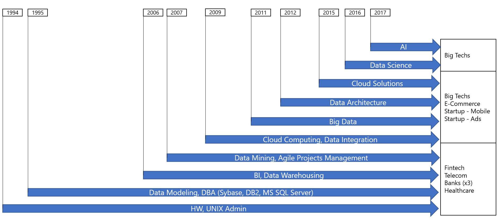
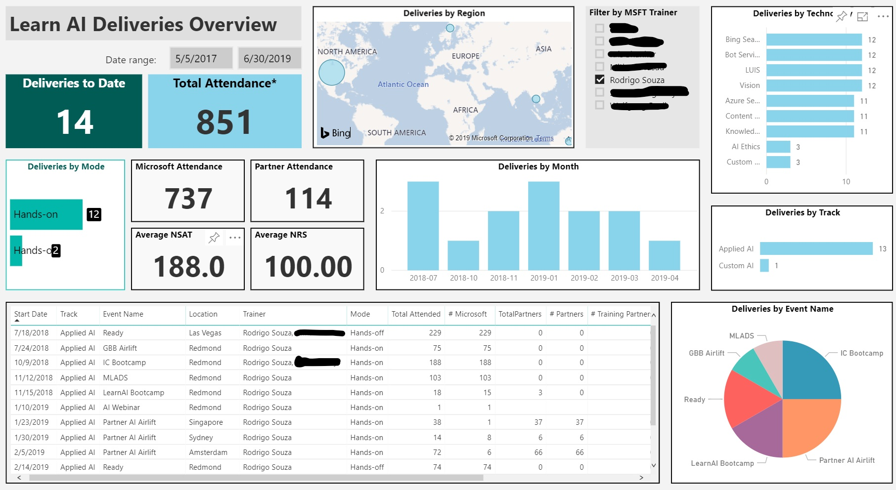
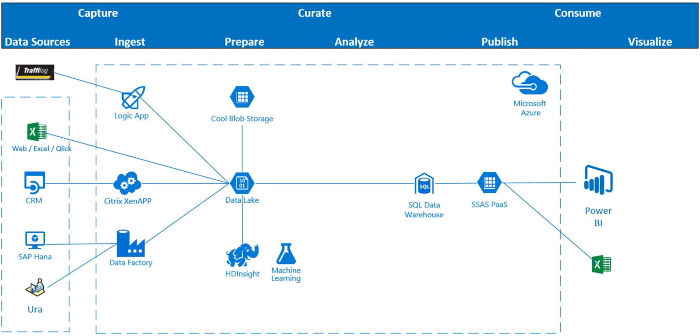

# Visual Detailed CV - Rodrigo Souza
Details of my career as a data professional: Highligts, cool projects, videos and so on. The objective is to register, and to share, here what doen't fit into a "regular CV". At the end of the day, a picture is worth a thousand words. Like the image below, my collection of Conferences Badges. This CV has photos of some of these deliveries, as well as images and links for videos I recorded for Microsoft AI Organization.

The next image is interesting. I created this CV visualization, the first image below, for a "Data Scientist Role" presentation. I also used it into my [How I became a Data Scientist](https://www.linkedin.com/pulse/how-did-i-become-data-scientist-rodrigo-souza/), which had thousands of visualizations. This image was also useful to help me understand how much my career has changed, how I went from reactive to proactive in terms of adopting new technologies. I really like to be an early adopter for new technologies. 

Don't you think that this kind of CV is much more efficient than a regular one?

## Key Personal Links 

+ LinkedIn Profile - https://www.linkedin.com/in/rodrigossz/
+ LinkedIn Articles - https://www.linkedin.com/in/rodrigossz/detail/recent-activity/posts/
+ Data is the New Oil - https://datanewoil.tumblr.com/
+ AI demos, labs, repos - http://aka.ms/ai-links
+ Youtube Channel - https://www.youtube.com/channel/UCZ_z0MqG2XMyxAE18V6NF1A
+ GitHub Repos - https://github.com/Rodrigossz

## Been an AI Developer at Microsoft

It was November 2017 when I moved from a DSA (Data Solutions Architect) position in Microsoft Brazil to be a Data Scientist here in Microsoft US, the  "CORP" as we call it. The first initial challenges were: 1) To create End-To-End AI Solutions, using multiple Azure Data & AI products. 2) To transform this solutions into trainings. 3) To deliver this trainings for Microsoft Employees and Partners all around the world. In my case, I taught AI in Redmond, Seattle, Bellevue, Bogota, Sao Paulo, London, Lisbon, Singapore, Sydney, Amsterdam, and New York.

Here are some of the trainings I helped to develop. For some of them, I just did maintenance, keeping relevant the work of brilliant colleagues. For some of them, I was the main developer. My code in Microsft Azure official GitHub repo:

+ [LearnAI - Knowledge Mining Bootcamp -KMB](https://github.com/Azure/LearnAI-KnowledgeMiningBootcamp)
+ [LearnAI - Airlift](https://github.com/Azure/LearnAI-Airlift)
+ [LearnAI - Designing and Architecting Intelligent Agents](https://github.com/Azure/LearnAI-DesigningandArchitectingIntelligentAgents)
+ [LearnAI - Cognitive Services Bootcamp - Computer Vision](https://github.com/Azure/LearnAI-bootcamp)

### KMB - Details

KMB, the first item in the list above, deserves more detailed comments: It was created by me, in partnership with the Product Team and some colleagues of the LearnAI Team of course. The image below is the solution architecture that you will build if you follow the course labs. 

When delivering this training around the world, it was interesting to see people creating their first search service, their for BOT, and so on. Disruptive aspects of this course:

+ Created while the product was under development. Both, product and course, were released at the same time.
+ First LearnAI training to have solution architecture, pricing, and collaboration
+ First LearnAI training that can also be used as a sales tool, demos and POCs in minutes, with your client data
+ First LearnAI training to be listed on Azure.com as an official product course
+ Unique Cognitive Search demo/training/solution to have a Bot instead of a website
+ First Cognitive Search initiative to use regular business data
+ Alternative Agendas
+ Unique existing training for Content Moderator API, at least until July/2019
+ Modular, each lab can be delivered separately
+ The Azure Search lab is a complete End-to-End training

I had the honor to have this training added to [Microsoft AI School](https://aischool.microsoft.com/en-us/machine-learning/learning-paths/ai-platform-engineering-bootcamps), as you can see in the image below.

**Innovation is a constant in my career!!** I just created a lab Knowledge Mining with Audio, what was never done before in Microsoft. Azure Search is the Azure's product for Knowledge Mining and it doesn't work with audio datatypes like wav or mp3. [This](https://github.com/Rodrigossz/KM-w-Audio) lab teaches you how to do it using Speech to Text API. And it can be connected to [KMB](http://aka.ms/kmb) as well!

## Been an AI Writer at Microsoft

Blog posts is something new, started on June 2019. We are the ACE Team now, AI Customer Engineering, and we have our own Microsoft Tech Community Blog. It is an honor to write for an official Microsoft Blog. For now my posts are:

+ [Learn How to Mine Knowledge from Audio Files](https://techcommunity.microsoft.com/t5/AI-Customer-Engineering-Team/Mine-knowledge-from-audio-files-with-Microsoft-AI/ba-p/781957)
+ [Learn How to Create End-to-End Solutions with Microsoft AI](http://aka.ms/Learn-Microsoft-AI)

## Been an AI Instructor at Microsoft

Since 2017, I could be Speaker/Presenter dozens of times, in the most important Microsoft conferences: MLADS, Intelligent Cloud Bootcamp, Global Black Belts (GBBs) Airlift, Inspire, and Microsoft Ready. There was also the LearnAI Bootcamps, when Microsoft AI Organization decided to invest on internal + partners readiness. 

### Microsoft Certified Hackathon Leader, Gold Speaker, and Trainer

All that conferences helped me to achieve important Microsoft certifications like Hackathon Leader, Gold Speaker and Certified Trainer. The image below has all Microsoft Certifications I have. There is more to come...

### Performance as an Instructor

The dashboard below has details of my deliveries as an AI Instructor: locations, technologies, scores, etc.

### Microsoft Content Moderator Webinar (live) - April 2019

This webinar was part of the Microsoft AI Inner Circle Partner Program, when I could talk about this important Cognitive Service for hundreds of people. You can see part of the recordings [here](https://www.youtube.com/watch?v=lrCkzINAFQQ&t=34s).

### Intelligent Cloud Bootcamp - Best Speaker - April 2019

My Knowledge Mining session had the best satisfaction score of the conference.

### Microsoft LearnAI Airlift - World Tour - February 2019

I had the opportinity to deliver the [LearnAI Airlift](https://github.com/Azure/LearnAI-Airlift), created by me in part, in Singapore, Sydney and Amsterdam. The satisfaction of the audience I obtained was 198/200, practically as much as possible. The technologies taught were Vision API, Custom Vision, CosmosDb, Bots, and Azure Search. The photo below was taken in Amsterdam.

### Azure TV - Knowledge Mining Workshop (live + pre-recorded) - January 2019

This "TV Show" was the first Microsoft training that mixed pre-recorded (content) and live videos (questions). It was two days of transmission, 3 hours each day. But the project demanded a lot of preparation. The basic technologies presented were Cognitive Search and Translator API. You can see a small part of one video [here](https://www.youtube.com/watch?v=2hgFUENKqLs&t=31s).

### MLADS - November 2018

MLADS is Microsoft's Machine Learning and Data Science Conference. I had a session on Microsoft Azure Cognitive Services.

### Digital Ready - Cognitive Search Webinar - Pre Recorded - May 2018

This time the video was recorded for the Microsoft Ready 2018 conference, trough its Digital Ready channel.

### Cognitive Search Webinar - March 2018

Webinar broadcasted live to 1100+ atendees, with NSAT 185/200. I presented the brand new technology and the [JFK use case](https://jfk-demo.azurewebsites.net/#/). You can see part of the webinar [here](https://www.youtube.com/watch?v=ll10PTrV0oM&t).

### LearnAI Bootcamps - Europe - February, March 2018

Another trip to teach AI around the world. The content was the [Cognitive Services Bootcamp](https://github.com/Azure/LearnAI-Bootcamp), whose content was Cognitive Services, Azure Search and Bots. The first stop was London, the second was Lisbon, the photo below.

Lisbon 1  | Lisbon 2
:--------------:|:--------------: 
 | 

### Data Science Workshop - Leveraging Azure Machine Learning for TDSP and DevOps - Februrary 2018

Interesting session delivered at the Intelligent Cloud Bootcamp, a partners ship with Buck Woody, a big Data and AI authority within Microsoft.

## Been a Microsoft Azure Cloud Solutions Architect

Some cool projects from my CSA role.

### IoT + Modern Data Warehouse solution for Wind Farms - August 2017

The client was installing the biggest Wind Farms of the country and they were looking for real time monitoring. Again I suggested the idea to cross validade the data with other data sources and we did a POC. It went very well and a vendor was hired to implement the solution. SAP data ingestion and weather forecast were a key diferentiators, as weel as the real time PBI dashboards.

### Data Lake for IoT + CRM + ERP Data - March 2017

The client was a giant company with industrial facilities distributed throughout the country. There were several parallel requirements such as: CIO needing to archive data from the CRM appliance, COO wanting to cross IoT data with transactional systems, CMO wanting to understand the behavior of customers.

I merged it all in a data lake project and did the first POC in the first week. It went very weel and we started to add data sources and advanced analytics with machine learning. 

The competitors didn't have a chance and after 2 months I was presenting the solution and the results to the CIO. When I showed my findings about industrial vehicles, he connected on time with the COO who confirmed the problems, being impressed with the ability to find insights into the data. I could find problems that they were not aware of, creating great motion for the project. 

The final data architecture is in the image below.

## Big Data projects from previous jobs

Some interesting old projects and achievments.

### Data Hub (or Data Lake) - PSafe - 5th most downloaded App in Play Store Brazil - 2014

PSafe reached 30MM of MAU, all generating a gigantic amount of LOGs. Something like 1 TB a day. Hadoop was used by it was hard to understand and to use the data. I worked there before and returned to the company as a leader in the data area, to reorganize the data infrastructure. We created a data lake to make sure we were storing and analysing the correct data. 

The project used Cloudera, including HIVE/PIG for batch processing and Impala for interactive queries. The project also included the data structure within HDFS: raw files, raw data, business data, BI data. Check the last image, a table, for more details. The images below are missing Impala and the parquet files, what we added in a second moment.

**Today, Julhe of 2019, this structure is still used, practically unchanged.**

Data Architecture 1  | Data Architecture 2 | Data Architecture 3
:--------------:|:--------------:|:--------------: 
 |  | 
 |  | 

### Innovation - Created a MPP DW in 2008

I am very proud of this project. Using SQL Server 2008 RS, [Microsoft Fast Track Reference Architecture](https://www.jamesserra.com/archive/2011/09/microsoft-sql-server-reference-architecture-and-appliances/), and very simple HW, I created a MPP DW for Lemon Bank, where I was working since 2002. I had to find a way to scale out, since the data volume was bigger than the total space of the biggest server available. A real Big Data problem, solved with lots of study and criativity. 

**Today, Julhe of 2019, this structure is still used, practically unchanged.**

Interesting points of this project:

+ ETL was SQL Scripts + bcp (DTS was not fast enought)
+ A view was the central fact table. Is was an UNION of hundreds of tables, all of them in different database. Each database was in a different disk, sometimes it was a different server (linked server). All records had an ID. Check constraints helped the optimizer to avoid unnecessary table access. 
+ Self Service BI on top of this, with Excel and a dynamic query interface too.
+ This project won The Brazilian Bank Industry Award (CIAB) in 2008.

MPP Database 1  | MPP Database 2
:--------------:|:--------------: 
 | 

Award 1  | Award 2
:--------------:|:--------------: 
 | 

## To Be Added - Data Lake in a Brazilian E-Commerce Giant

## To Be Added - Big Data Practice Leader in HP - 2012

## To Be Added - Innovation award in a HP - 2013

## Innovation - Agile methods - Lemon Bank 2007

In 2007 I was really angry with the lack of organization within the IT department. As a DBA, I was affected because I could not organize my work, and I was managing the data area. In that year, a friend returned from France where he did a PhD and learned about SCRUM. Back to Brazil, he acquired remarkable knowledge and experience on agile methods, including Kanban. He ended up opening a training company and called me for a presentation. I immediately identified the value of all that and also began to study the subject. 

The DBA team started to use Kanban in 2007, what helped not only our own work, but also to measure the impact of the others teams lack of methodology on us. I'm also a person with lots of connections and I helped my friend to sell one of his first in-company agile trainings. The client was a friend's software company that never heard about Agile before. Today, 2019, my Agile expert friend still have his consulting company, with dozens of employess and hundreds of clients. And my friend's software company is still using agile methods for all of its operations.

## Innovation awarded - Lemon Bank - 2006

In 2008 I was working for this Fintech and the all company was challenged to create a product to increase revenew. It was not expected  that someone from IT would give a suggestion to the business area. But I'm very creativity and I won it! I suggested a remuneration model for the employees of the affiliated networks. The screenshot below is a screenshot of the bank's intranet, with my photo illustrating the winning idea. The project was implementing and worked as expected

## Professional Photos by Microsoft

MGX - Orlando, July 2016         |  Discovery Day - Redmond, July 2019
:-------------------------:|:-------------------------:
  |  
